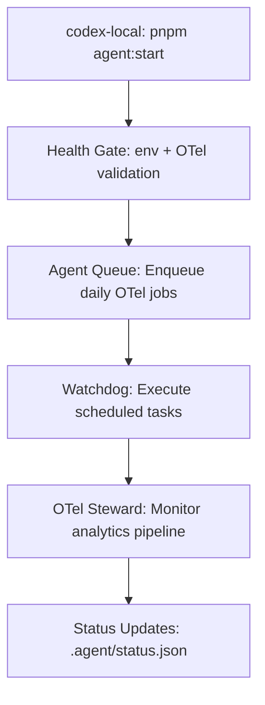

# Agent Integration Guide: codex-local ↔ OTel Steward

This guide explains how the **codex-local** and **OTel Steward** agents work together to maintain both local development environment health and observability pipeline integrity.

## 🏗️ Architecture Overview



## 📁 Key Files Created

### Integration Scripts
- `scripts/agent/health-gate.ps1` - Combined environment + OTel health validation
- `scripts/agent/update-status.ps1` - Shared status reporting for both agents

### Agent Configuration
- `.agent/agent_queue.json` - Job queue with OTel integration jobs
- `.agent/status.json` - Shared health status across agents

### Updated Scripts
- `scripts/verify-wiring.ps1` - Added explicit exit codes (0=healthy, 2=retryable)

## 🚀 Quick Start

### 1. Run Combined Health Check
```powershell
# This runs both env doctor + OTel verification + enqueues daily jobs
pwsh -File scripts/agent/health-gate.ps1
```

### 2. Check Agent Status
```powershell
# View current health status across all agents
Get-Content .agent/status.json | ConvertFrom-Json | ConvertTo-Json -Depth 6
```

### 3. Manual Status Updates
```powershell
# Update OTel status
pwsh -File scripts/agent/update-status.ps1 -section otel -ok $true -detail "OTLP/HTTP 5318 OK"

# Update analytics status  
pwsh -File scripts/agent/update-status.ps1 -section analytics -ok $true -detail "events/min steady"
```

## 🔄 Agent Queue Jobs

The queue includes three integrated jobs:

1. **env-ready** - Local environment health check (hourly)
2. **otel-wiring-check** - OTel pipeline verification (daily, depends on env-ready)
3. **otel-analytics-monitor** - Live analytics monitoring (hourly, depends on both above)

## 🛡️ Failure Handling

### Lock Respect
- Both agents check `.agent/LOCK` before running
- If lock exists, set status to `paused:lock` and exit gracefully

### Environment Dependencies
- OTel jobs only run after `env-ready` completes successfully
- Missing pnpm/prerequisites → `blocked:env` status with helpful hints

### Graceful Degradation
- OTel failures never block `/api/events` (best-effort tee)
- Analytics continue flowing even if monitoring fails

## 📊 Status Monitoring

The shared `.agent/status.json` provides real-time health across:

- **env**: Local development environment (pnpm, node, playwright)
- **otel**: OTel pipeline health (OTLP/HTTP 5318, dataset logs)
- **analytics**: Live analytics flow (events/min, TTV metrics)

## 🔧 Integration Points

### For codex-local
- Use `health-gate.ps1` in your `agent:start` workflow
- Monitor `.agent/status.json` for OTel health
- Respect OTel job dependencies in your queue

### For OTel Steward
- Check `.agent/LOCK` before any operations
- Update `.agent/status.json` with results
- Only run after `env-ready` dependency satisfied

## 🚨 Troubleshooting

### Common Issues

1. **Health gate fails on OTel check**
   - Ensure Resonai dev server is running (`pnpm dev`)
   - Check OTel collector service is running
   - Verify ports 5318 and 8080 are accessible

2. **Agent queue jobs not running**
   - Check `.agent/LOCK` is not present
   - Verify `env-ready` job completed successfully
   - Review job dependencies in queue

3. **Status updates not appearing**
   - Ensure `.agent/status.json` is writable
   - Check PowerShell execution policy
   - Verify script paths are correct

### Debug Commands

```powershell
# Check agent lock status
Test-Path .agent/LOCK

# View recent verification results
Get-Content artifacts/wiring-verify.txt -Tail 20

# Check job queue status
Get-Content .agent/agent_queue.json | ConvertFrom-Json | Select-Object -ExpandProperty jobs

# Test status updater
pwsh -File scripts/agent/update-status.ps1 -section otel -ok $true -detail "Test update"
```

## 📈 Next Steps

1. **Integrate health gate** into your existing `agent:start` workflow
2. **Monitor status.json** for early warning of issues
3. **Customize job schedules** based on your development patterns
4. **Add alerts** for critical failures (OTel pipeline down, analytics stalled)

This integration ensures both local development environment and observability pipeline remain healthy, with clear dependency management and graceful failure handling.
