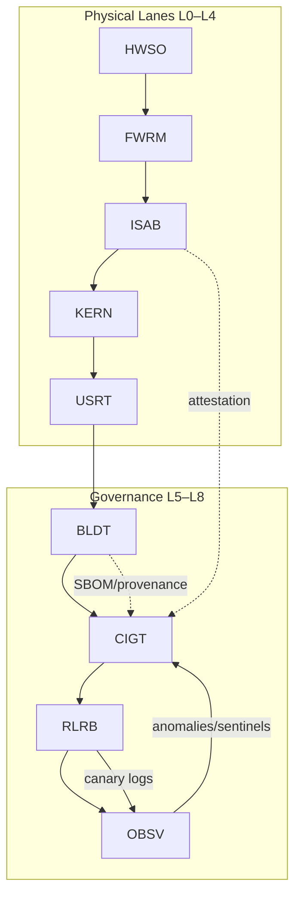

# Fractal Reference Map (Silicon → Site)

> **SUPERSEDED (2026-09-02).** Navigation map from the 2025 site/agent era. The live maps are
> `docs/status/REFERENCES_MAP.md` (v1.3) and `docs/architecture/CURRENT_ARCHITECTURE.md`.

**Tetragram IDs:**

- System Architecture View: `BOSS-CATX-RESE-SYAR`
- Fractal Reference Map (this doc): `BOSS-CATX-RESE-FRAM`

<!-- markdownlint-disable-next-line MD013 -->
Intent: Bind physical lanes (L0–L8) to logical governance loops so evidence and promotion remain deterministic from silicon to site.

---

## 1. Lanes (L0–L8) — Physical substrate

| Lane | Code | Name | Example Nodes |
|---|---|---|---|
| L0 | HWSO | Hardware / SoC | SoC, device/fuse keys, TRNG |
| L1 | FWRM | Firmware | Boot ROM, Bootloader, FW update agent |
| L2 | ISAB | ISA & Boot | ISA contracts, measured boot attestation |
| L3 | KERN | Kernel | Kernel image, modules, LSM/seccomp policy |
| L4 | USRT | Userspace | Runtime, config‑as‑code, secrets mgmt |
| L5 | BLDT | Build & Tooling | Source, toolchain, SBOM, tests |
| L6 | CIGT | CI Gates | Lint, budgets, required checks, sentinels, ECRR |
| L7 | RLRB | Release & Rollback | Canary, rollback switches, status report |
| L8 | OBSV | Observability | Logs/metrics/traces, RSI metrics, anomaly sentinels |

Edges are acyclic and auditable; contracts bind key checkpoints (e.g., attestation → checks; SBOM → checks).

---

## 2. Logical loop — ECRR over the lanes

At every lane boundary that can change state, we require ECRR evidence:

- Evidence: facts, diffs, logs, perf/trace artifacts
- Contain: freeze or narrow the blast radius (feature flags, lanes)
- Rollback: restore last‑known‑good with switches and plans
- Report: status entry and approvals, then exit

Paired agents enforce single‑writer discipline and bounded retry; any anomaly routes to ECRR first.

---

## 3. Determinism — Tetragram mapping

All artifacts, IDs, CI paths, and site keys derive from the same mapping function:

- Uppercase A–Z; keep letters; pad with X; first four per chunk.
- Canonical path mirrors the code: `/docs/BOSS/CATX/RESE/SYAR/...`.

This keeps names reversible and avoids taxonomy drift.

---

## 4. Performance & telemetry references

<!-- markdownlint-disable-next-line MD013 -->
Performance: Treat performance criteria as first‑class gates; CI must fail on threshold breach. Prefer k6 thresholds and short, targeted “changed‑paths only” runs on PRs; heavier validation pre‑release. Archive the JSON/HTML as gate evidence.

<!-- markdownlint-disable-next-line MD013 -->
Telemetry: Run a synthetic OTLP trace after staging deploy; verify ingestion and correlation across spans (HTTP server, clients, DB, gRPC). Enable zero‑code .NET auto‑instrumentation for services in scope to guarantee trace/metrics/log correlation.

---

## 5. Fractal view (Mermaid)

<!-- markdownlint-disable-next-line MD013 -->
The loop closes: build/publish evidence, gate on thresholds, promote canary, observe, and feed anomalies back to checks. RSI metrics live at L8 and inform L6 sentinels.

---

## 6. ICF (Iterative Convergence Framework)

The system evolves by small, safe steps in dual‑agent cycles:

- Each cycle contributes lessons and improvements (ICF doctrine).
- Background drills (Data Room) provide controlled perturbations to harden the loop.
<!-- markdownlint-disable-next-line MD013 -->
- RSI indicators (e.g., style integrity, reduction in flaky retries, faster green rates) are published as non‑blocking metrics unless configured.

---

## 7. Status and audit

- Status page surfaces Attestation verified, SBOM signed, Canary steady, ECRR evidence link, and next audit window.
- Approvals and overrides are explicit; prod gate remains STRICT with documented contracts.
