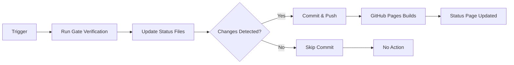

# 🤖 Status Dashboard Auto-Update System

**Status:** ✅ **ACTIVE** (Deployed 2025-10-22)  
**Authority:** Cursor{Implementer} via Fubumaki delegation  
**Purpose:** Ensure status dashboard stays current without manual intervention

---

## 🎯 Overview

The Status Auto-Update System automatically keeps
[https://hub.resonai.uk/docs/status.html](https://hub.resonai.uk/docs/status.html) synchronized with the latest gate
verification results, ensuring BossCat OEM always has current project status.

### Problem Solved

Before this system:

- ❌ Status updates required manual commit and push
- ❌ Working tree could accumulate uncommitted status files
- ❌ Status page could show stale data
- ❌ No guarantee of freshness between manual updates

After this system:

- ✅ Automatic updates every 6 hours
- ✅ Triggered after gate verification workflows
- ✅ Manual update option with one command
- ✅ Status page always reflects latest state

---

## 🏗️ Architecture

### Components (BossCat Compliant)

```text
┌─────────────────────────────────────────────────────────────┐
│          STATUS AUTO-UPDATE SYSTEM (BOSSCAT COMPLIANT)      │
├─────────────────────────────────────────────────────────────┤
│                                                               │
│  1. GitHub Actions Workflow (Agent A + B)                   │
│     ├── Agent A (Writer): Updates status files             │
│     ├── Agent B (Verifier): Read-only validation           │
│     ├── Creates PR (never pushes to main)                  │
│     ├── Enforces kill-switch (.agent/LOCK)                 │
│     ├── Enforces budgets (≤10 files, allow-list)           │
│     └── Scheduled: Every 6 hours + post-gate triggers      │
│                                                               │
│  2. Lane Discipline (PR Workflow)                           │
│     ├── Branch: bots/status-auto-update                    │
│     ├── Creates PR with evidence                           │
│     ├── Requires human/IONA approval                       │
│     └── "Merge is not a bot's honor"                       │
│                                                               │
│  3. Safety Guardrails                                        │
│     ├── Kill-switch: .agent/LOCK (exit 50)                 │
│     ├── Budget: ≤10 files, ≤200 LOC                        │
│     ├── Allow-list: artifacts/, docs/status/, docs/ecrr/   │
│     └── A/B pairing: Writer → Verifier                     │
│                                                               │
│  4. Deployment Pipeline                                      │
│     ├── PR merged to main → GitHub Pages builds            │
│     ├── Build time: ~60 seconds                             │
│     └── Live update: https://hub.resonai.uk/docs/status.html│
│                                                               │
└─────────────────────────────────────────────────────────────┘
```

---

## ⏰ Update Schedule

### Automatic Updates

| Trigger | Frequency | Description |
|---------|-----------|-------------|
| **Scheduled** | Every 6 hours | Runs at :15 minutes past 00:00, 06:00, 12:00, 18:00 UTC |
| **Post-Gate** | After gate workflows | Triggers when BossCat Gate Verification or Gate Nightly complete |
| **Manual** | On demand | Can be triggered via GitHub Actions UI or locally |

### Update Flow



---

## 📁 Files Updated

### Primary Status Files

| File | Purpose | Update Frequency |
|------|---------|------------------|
| `artifacts/gate-verification-results.json` | Current gate verification state | Every update |
| `docs/status/tests.json` | Test results and status metadata | Every update |
| `docs/status/kpis.json` | KPI metrics | Nightly (separate workflow) |

### Read-Only Dependencies

| File | Purpose | Updated By |
|------|---------|------------|
| `docs/GATE_STATUS_DASHBOARD.md` | Gate status documentation | Manual/gate approval process |
| `GATE_*_COMPLETION_SUMMARY.md` | Gate completion records | Manual/gate approval process |

---

## 🚀 Usage

### Automatic (Default)

No action required! The system runs automatically:

```yaml
# Scheduled runs (GitHub Actions)
- 00:15 UTC (daily)
- 06:15 UTC (daily)
- 12:15 UTC (daily)
- 18:15 UTC (daily)

# Plus: After any gate verification workflow completes
```

### Manual Trigger (GitHub Actions)

1. Go to [Actions → Status Dashboard
   Auto-Update](https://github.com/MoneyCat-inc/otel-ops-pack/actions/workflows/status-auto-update.yml)
2. Click "Run workflow"
3. Optional: Check "Force update even if no changes"
4. Click "Run workflow" button

### Local Manual Update

```powershell
# Update status files only (no commit)
pwsh -File scripts/update-status-dashboard.ps1

# Update and auto-commit
pwsh -File scripts/update-status-dashboard.ps1 -AutoCommit

# Production verification with auto-commit
pwsh -File scripts/update-status-dashboard.ps1 -Site prod -AutoCommit

# Force update even if verification fails
pwsh -File scripts/update-status-dashboard.ps1 -Force
```

---

## 🔧 Configuration

### GitHub Actions Workflow

File: `.github/workflows/status-auto-update.yml`

```yaml
on:
  schedule:
    - cron: "15 */6 * * *"  # Every 6 hours
  workflow_dispatch: {}     # Manual trigger
  workflow_run:             # After gate workflows
    workflows: ["BossCat Gate Verification", "Gate Nightly Verification"]
    types: [completed]
```

### Permissions Required

```yaml
permissions:
  contents: write  # To commit and push updates
  actions: read    # To read workflow run data
```

### BossCat Governance Compliance

**Lane Discipline:**

- ✅ Creates PR via `peter-evans/create-pull-request`
- ✅ Never pushes directly to `main`
- ✅ "Merge is not a bot's honor"

**Safety Guardrails:**

- ✅ Kill-switch: `.agent/LOCK` check (exit 50)
- ✅ Budgets: ≤10 files, allow-list enforced
- ✅ A/B pairing: Writer (Agent A) + Verifier (Agent B)
- ✅ Timeout: 10 minutes max

**Exit Codes:**

- `0` - Success
- `50` - Kill-switch active (paused)
- `52` - Budget violation
- `53` - Gate verification failed

---

## 📊 Monitoring

### Check Last Update

Visit the status page and check the timestamp:

```text
https://hub.resonai.uk/docs/status.html
```

Look for:

- **Timestamp:** Shows when status was last updated
- **Commit:** Shows commit hash for verification

### View Workflow Runs

Check recent auto-update runs:

```text
https://github.com/MoneyCat-inc/otel-ops-pack/actions/workflows/status-auto-update.yml
```

### Review Commits

Auto-update commits follow this pattern:

```yaml
chore(status): auto-update dashboard - gate #8 APPROVED @ 49e029648 [skip ci]

Automated status update from status-auto-update workflow
Triggered: schedule
Run: 18719495052
```

---

## 🛡️ Guardrails

### Concurrency Control

Only one auto-update can run at a time:

```yaml
concurrency:
  group: status-update-${{ github.workflow }}-${{ github.ref }}
  cancel-in-progress: false
```

### Skip CI Loops

Auto-update commits include `[skip ci]` to prevent triggering other workflows:

```bash
git commit -m "chore(status): auto-update dashboard [skip ci]"
```

### Fallback Behavior

If gate verification fails:

- Workflow continues with fallback data
- Verdict set to "UNKNOWN"
- Error captured in verification JSON
- Status page still updates (shows degraded state)

### Timeout Protection

Workflow has 15-minute timeout to prevent hanging.

---

## 🐞 Troubleshooting

### Status Page Not Updating

**Check:**

1. Workflow ran successfully: [Check
   Actions](https://github.com/MoneyCat-inc/otel-ops-pack/actions/workflows/status-auto-update.yml)
2. Commit was pushed: `git log --oneline -5 | grep "auto-update"`
3. GitHub Pages deployed: Check the repo's **Deployments** panel (GitHub UI; the direct URL 404s for anonymous visitors)
4. Cache issue: Hard refresh (Ctrl+Shift+R)

### Verification Fails Every Time

**Diagnose:**

```powershell
# Run verification manually
pwsh -File scripts/verify-iona-gate.ps1 -Site ci -OutputJson test.json

# Check output
cat test.json
```

**Fix:** 

- GitHub-hosted runners do not have live telemetry; the workflow automatically logs a warning and continues with
  fallback data when verification fails.
- Update verification script if gate criteria changed 
- Adjust thresholds if too strict 
- Use `-Force` flag to update despite failures 

### Local Script Errors

**Common Issues:**

1. **PowerShell version:** Requires PowerShell 7+

   ```powershell
   $PSVersionTable.PSVersion  # Should be 7.x
   ```

2. **Working tree dirty:** Clean before `-AutoCommit`

   ```powershell
   git status
   git stash  # If needed
   ```

3. **Permission denied:** Check GitHub credentials

   ```powershell
   git push  # Test push access
   ```

---

## 🔄 Integration with Existing Systems

### Works With

- ✅ **BossCat Gate Verification** - Triggers after gate checks
- ✅ **Gate Nightly Verification** - Triggers after nightly runs
- ✅ **Update KPIs Workflow** - Runs alongside (different files)
- ✅ **GitHub Pages** - Auto-deploys after commits
- ✅ **BossCat Agent** - Can be added to scheduled tasks

### Complements

- **Manual gate approval process** - This handles automated status updates between gates
- **ECRR methodology** - Verification results feed ECRR evidence
- **Hub Production deployment** - Status updates deploy automatically

---

## 📚 Related Documentation

- **Verification Script:** `scripts/verify-iona-gate.ps1`
- **Gate Protocol:** `docs/comfort-cat/GATE_PROTOCOL.md`
- **Hub Production:** `HUB_PRODUCTION_LIVE.md`
- **BossCat Charter:** `docs/BossCat/CHARTER.md`

---

## 🎯 Success Criteria

Status Auto-Update System is successful when:

- ✅ Status page updates within 6 hours of any code change
- ✅ BossCat OEM can check status anytime without manual intervention
- ✅ No accumulation of uncommitted status files in working tree
- ✅ Status reflects latest gate verification results
- ✅ System recovers gracefully from verification failures

---

## 🔮 Future Enhancements

Potential improvements:

1. **Slack/Discord Notifications** - Alert on status changes
2. **Status History Tracking** - Track status changes over time
3. **Predictive Alerts** - Warn before status degrades
4. **Multi-Environment Support** - Separate status for prod/stg/dev
5. **Real-Time WebSocket Updates** - Live status without page refresh

---

**Status:** ✅ **ACTIVE & OPERATIONAL**  
**Next Review:** 2025-11-01  
**Owner:** Cursor{Implementer}  
**Authority:** Fubumaki

_Auto-update system deployed. Status dashboard will remain current without manual intervention._ 🐾
