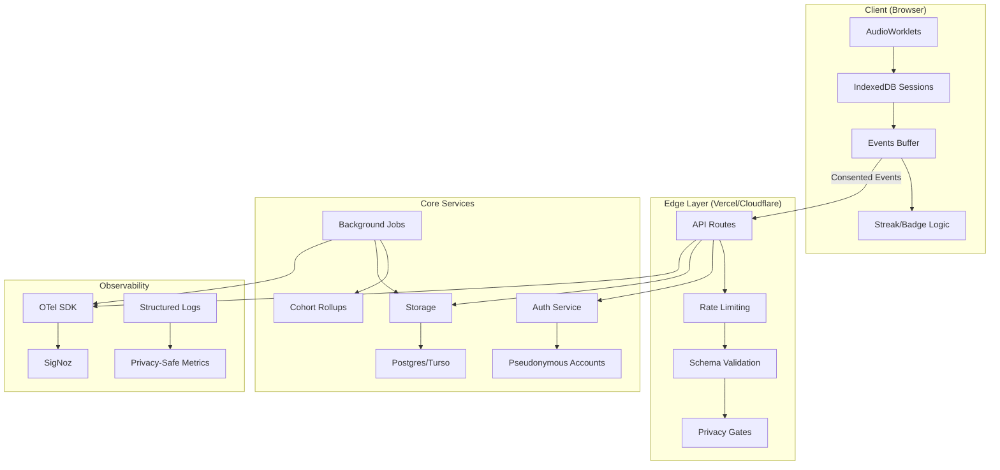

# 🎛️ Resonai Backend Blueprint
## Local-First, Consent-First Architecture

> **Philosophy**: No voice/audio leaves the device. Only essential engagement metrics and opt-in features touch the server.

---

## 🎯 Core Principles

### Local-First by Default
- **Audio processing**: 100% client-side via AudioWorklets
- **Session data**: Stored in IndexedDB, synced only when consented
- **Practice logic**: Runs in-browser, server provides minimal coordination

### Consent + Minimization
- **Default deny**: All sharing disabled by default
- **Granular controls**: Separate toggles for metrics, coach access, cross-device sync
- **One-click deletion**: Complete data export and deletion flows
- **Transparent**: Clear data usage policies and audit trails

### Stateless Edges, Small Core
- **80% Edge/Serverless**: Vercel Functions for most operations
- **20% Core Services**: Only for state requiring consistency (auth, moderation)
- **Event-driven**: Background jobs via Vercel Cron for housekeeping

---

## 🏗️ Architecture Overview



---

## 🗂️ Data Model

### Pseudonymous User
```typescript
type User = {
  id: string;                    // ULID
  createdAt: string;
  email?: string;                // Only if opted-in (magic link)
  consent: {
    shareMetrics: boolean;       // false by default
    shareClips: boolean;         // always false for now
    coachPortal: boolean;        // off by default
  };
  // Hashed for cohort grouping, not identification
  userIdHash: string;            // sha256(userId + serverSalt)
};
```

### Engagement Profile (Opt-in Sync)
```typescript
type EngagementProfile = {
  userId: string;
  streakDays: number;
  badges: string[];              // ["first_session", "week_1", ...]
  lastPracticeAt: string;
  prefs: { 
    reducedMotion?: boolean;
    theme?: 'light' | 'dark' | 'auto';
  };
  // Client remains source of truth
  lastSyncAt: string;
};
```

### Cohort Events (Aggregated, Privacy-Safe)
```typescript
type Event = {
  id: string;
  ts: number;
  userIdHash: string;            // Hashed, not reversible
  kind: "session_start" | "session_end" | "streak_tick" | "badge_unlock" | "a11y_toggle";
  props: Record<string, number | string | boolean>;
  schema: "v1";
  // No raw audio, no full traces
  cohort: string;                // Derived from userIdHash
};
```

### Narrative Content (Static, Versioned)
```typescript
type StoryChapter = {
  id: string;
  title: string;
  body: string;                  // Text only; client renders
  choices: { 
    id: string; 
    label: string; 
    next: string;
  }[];
  version: string;               // Immutable versions
  publishedAt: string;
};
```

### Coach Grants (E2E Encrypted)
```typescript
type CoachGrant = {
  id: string;
  userId: string;
  coachId: string;
  scope: "metrics" | "notes";
  encryptedBlob: string;         // E2E encrypted summary
  expiresAt: string;
  createdAt: string;
  // Server never sees plaintext
};
```

---

## 🔌 API Surface

### Authentication
- `POST /api/auth/magic-link` → Send link if user opted-in to account
- `POST /api/auth/callback` → Finalize session (short-lived JWT, httpOnly)
- `POST /api/auth/passkey` → Passkey registration/authentication
- `DELETE /api/auth/session` → Revoke session

### Consent & Profile
- `GET /api/me/consent` → Get current consent settings
- `PUT /api/me/consent` → Update opt-ins (with audit log)
- `GET /api/me/engagement` → Get engagement profile
- `PUT /api/me/engagement` → Sync streak/badges (client source of truth)

### Events (Cohort Analytics)
- `POST /api/events/batch` → Accept small batches (sendBeacon)
  - Validates schema, clamps props, hashes IDs server-side
  - Drops PII, rate-limited per userIdHash

### Narrative
- `GET /api/story/chapters?v=YYYYMMDD` → Cacheable JSON (immutable versions)
- `POST /api/story/progress` → Store last chapter (if opted-in, for cross-device)

### Coach Portal (MVP)
- `POST /api/coach/grant` → User generates E2E grant (scope+expiry)
- `GET /api/coach/:grantId` → Returns encrypted blob; coach decrypts client-side
- `DELETE /api/coach/:grantId` → Revoke grant

### Data Protection
- `GET /api/me/export` → Complete data export (GDPR/CCPA)
- `DELETE /api/me` → Complete account deletion with cascade

### Feedback & Moderation
- `POST /api/feedback` → Text only; rate-limited
- `POST /api/report` → Abuse/report with hash-based user grouping

---

## 🔐 Security & Privacy Defaults

### Data Minimization
- **No audio uploads** - processing stays client-side
- **PII minimal** - email optional, hashed userIdHash for cohort joins
- **E2E encryption** - for any shared metrics/coach grants
- **Default deny** - all sharing disabled by default

### Privacy Controls
- **DPO flows** - One-click export and deletion
- **Audit trails** - All consent changes logged
- **Data retention** - Automatic cleanup of expired data
- **Right to be forgotten** - Complete cascade deletion

### Technical Security
- **Rate limiting** - Token-bucket per IP + userIdHash
- **CORS/CSP** - Strict, only your origin
- **Secrets management** - KMS-managed, no secrets in client
- **Input validation** - Zod schemas, reject extra fields

---

## 🏗️ Implementation Stack

### Runtime & Deployment
- **Next.js** - Full-stack framework with excellent DX
- **Vercel Functions** - Serverless deployment with global edge
- **Edge Runtime** - For hot paths (events) - fast, global

### Database
- **Postgres** (Neon) with Prisma OR **Turso** (SQLite) for simplicity
- **Start with SQLite-edge** if preferring fewer moving parts
- **Connection pooling** for serverless functions

### Authentication
- **Lucia** or **NextAuth** with passkeys/magic links
- **Short-lived sessions** with refresh token rotation
- **Pseudonymous by default** - no PII required

### Validation & Types
- **Zod/Valibot** schemas shared between client & server
- **Strict validation** - reject extra fields, clamp values
- **TypeScript** end-to-end type safety

### Background Jobs
- **Vercel Cron** for daily streak rollover, retention snapshots
- **Event-driven** cleanup of expired grants and old data

---

## 📈 Observability Integration

### OTel Integration
```typescript
// API handler with OTel tracing
export const POST = withOTel(async (req) => {
  const span = trace.getActiveSpan();
  span?.setAttributes({
    'api.route': 'events_batch',
    'batch.size': events.length,
    'user.cohort': cohortId
  });
  
  // ... handler logic
  
  return json({ ok: true });
});
```

### Metrics & Logging
- **Route tagging** - All endpoints tagged with operation type
- **Privacy-safe metrics** - No PII in traces or logs
- **Structured logging** - Redact by policy, sample <1% for low-value endpoints
- **Performance monitoring** - p95 handler time, rate-limit hits

### SigNoz Queries
```sql
-- Cohort engagement trends
SELECT 
  cohort,
  DATE_TRUNC('day', timestamp) as day,
  COUNT(*) as events
FROM events 
WHERE kind = 'session_start'
GROUP BY cohort, day
ORDER BY day DESC;

-- API performance
SELECT 
  route,
  percentile(99, duration_ms) as p99_latency
FROM api_requests
WHERE timestamp > NOW() - INTERVAL '1 day'
GROUP BY route;
```

---

## 🧪 Testing & Quality Gates

### Contract Tests
- **Dredd/Pact** - Client ↔ API contract validation
- **Schema evolution** - Backward compatibility testing
- **Privacy compliance** - Automated PII detection

### Property Tests
- **Streak/badge rules** - Fast-check property testing
- **Engagement calculations** - Mathematical correctness
- **Privacy transformations** - Hash consistency, data minimization

### E2E Testing
- **Playwright** - APIRequest + browser flows
- **Privacy flows** - Consent toggles, data export/deletion
- **Cross-device sync** - Engagement profile synchronization

### Privacy CI Gates
- **Block audio uploads** - Any endpoint accepting `audio/*` fails CI
- **Schema approval** - Changes to data models require privacy review
- **PII scanning** - Automated detection of potential PII in code

### Load Testing
- **k6 scripts** - `POST /api/events/batch` at expected DAU
- **Rate limit validation** - Ensure abuse protection works
- **Edge performance** - Global latency testing

---

## 🚦 Rollout Plan

### Week 0-1: Foundation
- [ ] `POST /api/events/batch` (edge runtime)
- [ ] `GET/PUT /api/me/engagement` 
- [ ] Minimal auth (anonymous cookie + magic link)
- [ ] Basic OTel integration

### Week 2-3: Consent & Sync
- [ ] Consent endpoints with audit logging
- [ ] Streak/badges sync implementation
- [ ] Daily cron for streak rollover
- [ ] Progress dashboard API

### Week 4-6: Advanced Features
- [ ] Narrative JSON hosting with immutable versions
- [ ] Coach grant (E2E) MVP
- [ ] Moderation endpoints
- [ ] Passkey authentication
- [ ] Retention snapshot jobs

### Week 7-8: Polish & Scale
- [ ] Cohort dashboards (internal)
- [ ] Performance optimization
- [ ] Comprehensive testing suite
- [ ] Privacy compliance audit

---

## 📊 Success Metrics

### Privacy Compliance
- **Zero audio uploads** - Automated detection in CI
- **Consent audit trail** - 100% of changes logged
- **Data minimization** - Regular schema reviews
- **Right to be forgotten** - Complete deletion in <24h

### Performance
- **API latency** - p95 < 200ms for edge functions
- **Availability** - 99.9% uptime for core endpoints
- **Rate limiting** - Effective abuse protection
- **Global edge** - <100ms latency worldwide

### Engagement
- **Opt-in rates** - Track consent progression
- **Data sync** - Engagement profile accuracy
- **Coach adoption** - E2E grant usage
- **Cohort insights** - Actionable analytics

---

## 🔄 Maintenance & Evolution

### Regular Reviews
- **Monthly privacy audit** - Data usage, consent flows
- **Quarterly architecture review** - Scaling, new features
- **Annual compliance check** - GDPR, CCPA, COPPA

### Monitoring & Alerting
- **Privacy violations** - Immediate alerts for PII exposure
- **Performance degradation** - p95 latency spikes
- **Abuse patterns** - Rate limit violations, suspicious activity
- **Data quality** - Schema validation failures

### Documentation
- **API documentation** - OpenAPI specs with privacy notes
- **Privacy policy** - Clear data usage explanations
- **Developer guides** - Integration examples, best practices
- **Incident response** - Security and privacy playbooks

---

This blueprint provides a solid foundation for Resonai's backend while maintaining the local-first, consent-first philosophy. The implementation prioritizes privacy, performance, and developer experience while enabling the engagement and coach features needed for T6.
