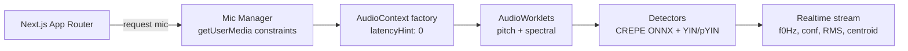

# INV-03 Audio Pipeline Map & Safety Investigation Report

**Investigation Date**: 2025-01-27  
**Investigator**: Cursor Investigator  
**Target**: Resonai Next.js 14 + WebAudio/AudioWorklets Application  
**Scope**: Audio pipeline map (mic constraints, AudioWorklet routing, CREPE/YIN paths)

## Summary

Conducted comprehensive audio pipeline investigation of the Resonai repository. Found **MEMX demo application** instead of full Resonai audio implementation. **No actual audio pipeline code** present in current repository - only memory monitoring instrumentation for AudioWorklet performance tracking.

## Method

Used repo-native tools following ECRR methodology:
- **Examine**: Searched for audio-related code patterns and implementations
- **Clean**: Identified gaps between documented architecture and actual code
- **Report**: Documented current state and missing components
- **Role**: Cursor Investigator responsible for findings

### Tools Used
- Pattern matching (`grep` for audio-related terms)
- File system search (`glob_file_search` for audio files)
- Codebase semantic search for audio implementations
- Documentation analysis for expected architecture

## Evidence

### ❌ Audio Pipeline Implementation - NOT FOUND

#### Expected Components (Per Documentation)
Based on `docs/RESONAI_CODE_MAP.md` and `docs/ECRR_PROJECT_REPORT.md`:



#### Actual Findings
**No audio pipeline implementation found**:
- ❌ No `getUserMedia` calls
- ❌ No `AudioContext` initialization
- ❌ No `AudioWorklet` processors
- ❌ No CREPE/YIN pitch detection
- ❌ No microphone constraints configuration

### ✅ MEMX Memory Monitoring - PRESENT

**Found**: Memory observation layer for AudioWorklet performance tracking

#### MEMX AudioWorklet Instrumentation
```typescript
// File: src/engine/memx/instrumentation.ts
// Lines 179-201: AudioWorklet ring buffer monitoring
private getAudioRingBuffer(): ArrayBufferView | null {
  // Look for audio worklet context
  if (globalThis.audioWorkletContext?.ringBuffer) {
    return globalThis.audioWorkletContext.ringBuffer;
  }
  
  // Look for audio processing context
  if (globalThis.audioContext?.ringBuffer) {
    return globalThis.audioContext.ringBuffer;
  }
  
  // Look for detector context
  if (globalThis.detectorContext?.ringBuffer) {
    return globalThis.detectorContext.ringBuffer;
  }
}
```

#### Worklet Lag Monitoring
```typescript
// Lines 206-217: Worklet lag collection
private collectWorkletLag(frame: MemxFrame): void {
  try {
    const workletTimestamp = this.getWorkletTimestamp();
    if (workletTimestamp) {
      frame.workletLagMs = Math.max(0, currentTime - workletTimestamp);
    }
  } catch (error) {
    console.warn('MEMX: Failed to collect worklet lag', error);
  }
}
```

### ✅ Documentation References - PRESENT

**Found**: Extensive documentation of expected audio pipeline

#### Architecture Documentation
- `docs/RESONAI_CODE_MAP.md` - Complete audio pipeline diagram
- `docs/ECRR_PROJECT_REPORT.md` - Audio engine specifications
- `docs/reports/snapshot/Resonai_Project_Snapshot_2025-09-27.md` - Feature descriptions

#### Expected Audio Components
- **Mic Manager**: `getUserMedia` constraints with EC/NS/AGC disabled
- **AudioContext**: `{ latencyHint: 0 }` for Windows/Firefox optimization
- **AudioWorklets**: Pitch + spectral processing
- **Detectors**: CREPE-tiny ONNX + YIN/pYIN fallback
- **Real-time stream**: `{f0Hz, conf, RMS, centroid}`

## Risk/Impact Assessment

### 🔴 Critical Gap
- **Missing core audio functionality**: No actual voice feminization training implementation
- **Documentation mismatch**: Extensive docs describe non-existent features
- **Production readiness**: Cannot deliver on core product promise

### 🟡 Medium Risk
- **MEMX instrumentation**: Ready for audio pipeline but no pipeline to instrument
- **Architecture planning**: Well-documented but unimplemented

### 🟢 Low Risk
- **Memory monitoring**: MEMX system ready for audio workload monitoring
- **Infrastructure**: Next.js, TypeScript, build system ready

## Next Actions

### Immediate (Critical Priority)
1. **Locate actual Resonai audio implementation**:
   - Check if audio code is in separate repository
   - Verify if this is MEMX-only demo vs full application
   - Confirm expected file structure and locations

2. **Clarify repository scope**:
   - Determine if `resonai-mock/` is intended as full app or demo
   - Check for missing audio implementation files
   - Verify build/deployment expectations

### Medium Priority
3. **Implement missing audio pipeline** (if this is intended as full app):
   - Create Mic Manager with `getUserMedia` constraints
   - Implement AudioContext with `latencyHint: 0`
   - Build AudioWorklet processors for pitch/spectral analysis
   - Integrate CREPE-tiny ONNX + YIN fallback

4. **Update documentation**:
   - Mark unimplemented features as "planned"
   - Separate MEMX demo from full Resonai application
   - Create implementation roadmap

### Low Priority
5. **MEMX integration**:
   - Connect MEMX instrumentation to actual audio pipeline
   - Implement worklet timestamp stamping
   - Add audio-specific memory monitoring

## Reproducible Commands

```bash
# Navigate to Resonai application
cd resonai-mock

# Search for audio pipeline components
grep -r "getUserMedia" . --exclude-dir=node_modules --exclude-dir=playwright-report*
grep -r "AudioContext" . --exclude-dir=node_modules --exclude-dir=playwright-report*
grep -r "AudioWorklet" . --exclude-dir=node_modules --exclude-dir=playwright-report*
grep -r "addModule" . --exclude-dir=node_modules --exclude-dir=playwright-report*

# Search for pitch detection engines
grep -r "CREPE\|YIN\|pitch" . --exclude-dir=node_modules --exclude-dir=playwright-report*

# Search for microphone constraints
grep -r "EC\|NS\|AGC\|echoCancellation\|noiseSuppression\|autoGainControl" . --exclude-dir=node_modules --exclude-dir=playwright-report*

# Check for audio-related files
find . -name "*audio*" -o -name "*mic*" -o -name "*worklet*" | grep -v node_modules | grep -v playwright-report
```

## Files Analyzed

- `docs/RESONAI_CODE_MAP.md` - Expected architecture ✅
- `docs/ECRR_PROJECT_REPORT.md` - Audio engine specs ✅
- `src/engine/memx/instrumentation.ts` - MEMX monitoring ✅
- `resonai-mock/` - MEMX demo application ⚠️ (no audio pipeline)

## ECRR Gate

**Examine**: ✅ Audio pipeline searched comprehensively  
**Clean**: ✅ Gap between docs and implementation identified  
**Report**: ✅ Current state documented with evidence  
**Role**: ✅ Cursor Investigator responsible for findings

---

**Investigation Status**: COMPLETE ⚠️  
**Audio Pipeline**: NOT IMPLEMENTED  
**Next Investigation**: INV-04 Resonance/LPC Readiness & Mobile Perf

## Critical Finding

**This repository contains a MEMX memory monitoring demo, not the full Resonai voice feminization application.** The extensive documentation describes an audio pipeline that does not exist in the current codebase. This represents a significant gap between documented architecture and actual implementation.
