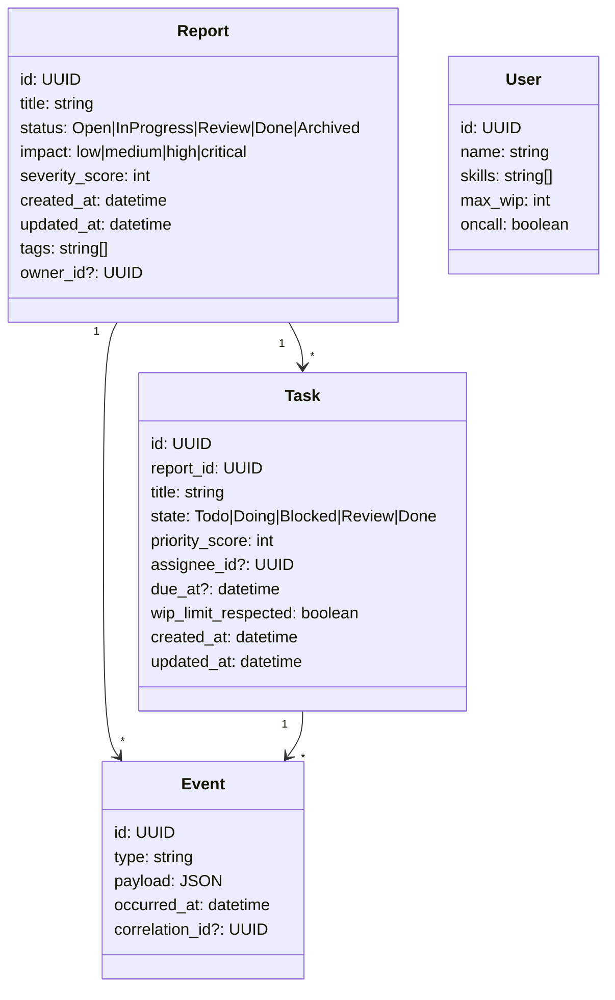

# ECRR Phase 1 Implementation Plan
## Automated Task Generation & Workflow Automation

**Date**: 2025-01-27  
**Version**: 1.0  
**Scope**: 30-day implementation of automated ECRR workflow system  

## Abstract

ECRR is effective but under-automated; Phase-1 focuses on automated task generation, evented workflows, and notifications.

## Phase 1 Outcome (30 days)

**What changes for users & ops**:
- New and updated ECRR reports automatically **spawn actionable tasks** with **priority scoring**, assignees, and due-by dates
- A **workflow engine** advances items through a **clear state machine** (triage → in-progress → review → done/blocked), with **time-based triggers** (SLA clocks, escalations) and **event-based triggers** (dependency unblocked, status changed)
- **Notifications** (email/Slack/webhooks—configurable) fire for new work, SLA risk, unblocks, and completions
- A **dashboard** and **ledger sync** reflect the new task layer and provide real-time counts (Open, Due soon, Overdue)

**Phase 1 success criteria**:
- ≥ 90% of newly created reports auto-generate at least one correctly-scored task without manual edits
- ≥ 80% reduction in manual triage time for new reports (baseline vs. post-launch)
- ≤ 5% SLA breaches on high-priority items in the first 30 days
- End-to-end latency from report creation → task visible to assignee **< 60s** (P95)

## 1. Phase 1 Backlog (Ready to Paste as Issues)

### A. Automated Task Generation

#### A1 — Rules Engine MVP
- **Goal**: Auto-spawn tasks when a report is added/updated
- **Acceptance**: Given a new "Open" report tagged `impact:high`, the system creates a task within 1 minute with a priority derived from impact and due-in set by policy
- **Files**: `src/rules/priority-engine.ts`, `src/rules/task-templates.yaml`
- **Dependencies**: Database schema (A3)

#### A2 — Priority Model
- **Goal**: Deterministic priority from (impact, aging, owner availability)
- **Acceptance**: Same inputs always yield the same `priority_score`; ties broken by report age
- **Files**: `src/rules/priority-calculator.ts`, `config/priority-rules.json`
- **Dependencies**: None

#### A3 — Assignment Policy
- **Goal**: Auto-assign tasks by skill/rotation while respecting max WIP per assignee
- **Acceptance**: No assignee exceeds configured WIP; on overflow, task stays unassigned but queued
- **Files**: `src/rules/assignment-engine.ts`, `config/assignment-policy.json`
- **Dependencies**: User management system

### B. Workflow Automation

#### B1 — Event Bus & Triggers
- **Goal**: Emit/consume domain events: `ReportCreated`, `ReportUpdated`, `TaskCompleted`, `SLAWarning`
- **Acceptance**: Events appear in an append-only log; consumers process idempotently
- **Files**: `src/events/event-bus.ts`, `src/events/event-store.ts`
- **Dependencies**: Database schema (A3)

#### B2 — State Machine
- **Goal**: Formalize report lifecycle (`Open → In-Progress → Review → Done / Archived`) and task lifecycle
- **Acceptance**: Illegal transitions rejected; transitions emit events
- **Files**: `src/workflow/state-machine.ts`, `src/workflow/lifecycle-rules.json`
- **Dependencies**: Event bus (B1)

### C. Integrations & Notifications

#### C1 — Notification Matrix
- **Goal**: Notify the right people for the right things (creation, SLA risk, blockage)
- **Acceptance**: Matrix drives channels (email/Slack/webhook) with batched digests; no duplicate alerts
- **Files**: `src/notifications/notification-router.ts`, `config/notification-matrix.yaml`
- **Dependencies**: Event bus (B1)

#### C2 — API Endpoints
- **Goal**: Read/write endpoints for Reports, Tasks, Events
- **Acceptance**: Auth, rate limits, pagination; OpenAPI doc published
- **Files**: `src/api/reports.ts`, `src/api/tasks.ts`, `src/api/events.ts`
- **Dependencies**: Database schema (A3)

### D. Observability & Guardrails

#### D1 — KPIs & Dashboards
- **Goal**: Expose Automation Coverage, Manual Intervention %, SLA Breaches, Time-to-Task
- **Acceptance**: Four KPIs render from production data; weekly trends visible
- **Files**: `src/dashboard/kpi-calculator.ts`, `src/dashboard/dashboard-api.ts`
- **Dependencies**: Database schema (A3)

#### D2 — Policy as Code
- **Goal**: Checkers that fail CI if rules/regressions detected (e.g., task without reporter)
- **Acceptance**: CI fails on violations with actionable error text
- **Files**: `src/guardrails/policy-checker.ts`, `.github/workflows/policy-check.yml`
- **Dependencies**: CI/CD pipeline

## 2. Domain Model (Minimal, Versionable)



## 3. Task-Generation Rules (MVP Policy)

### Priority Formula (Deterministic)

```
priority_score =
  400 * impact_weight(impact) +
  3   * report_age_days +
  15  * is_blocked +
  25  * missing_owner +
  10  * (open_tasks_on_report > 5)
```

**Impact weights**: `low=1, medium=2, high=3, critical=4`

### Assignment Logic

1. Filter users with required skill tag(s) inferred from report tags
2. Exclude assignees where `current_wip >= max_wip`
3. Prefer on-call; then fewest WIP; then round-robin fallback
4. If none available, leave unassigned and flag `assignment_needed`

### Due Date Policy

- `critical`: +2 business days
- `high`: +5 business days
- `medium`: +10 business days
- `low`: optional / backlog

## 4. Evented Workflow (How It All Moves)

```text
ReportCreated ─┐
ReportUpdated ─┼──► Rules Engine ► (Create/Update Tasks) ► TaskCreated/Updated
SLAWarning  ───┘
                     │
                     ├──► Notification Router (matrix)
                     │
                     └──► KPI Sink (metrics store)
```

**Idempotency key**: `${event.id}:${rule.id}` — store a "seen" token so reruns don't duplicate work

## 5. Implementation Timeline (4 Weeks)

### Week 1 – Foundations
- [ ] Set up DB tables, ingest endpoint, templates repo folder, basic rules engine
- [ ] Implement `report.created` → `tasks` flow
- [ ] Backfill 29 open reports; dry-run notifications to a sandbox channel

### Week 2 – Workflow & SLA
- [ ] State machine transitions + validation
- [ ] Scheduler (SLA warnings/breaches), escalation logic, notifications with throttling

### Week 3 – Dashboard & Hardening
- [ ] Lightweight dashboard (server-rendered or simple React page)
- [ ] Idempotency, dedupe, dependency un/block hooks
- [ ] Load test the ingest path (target ≥ 50 reports/min burst)

### Week 4 – Pilot & Tune
- [ ] Pilot flag on: 30% of new reports use autogen
- [ ] Measure triage time, SLA warnings, breach rate; tune thresholds
- [ ] Expand to 100% if KPIs met

## 6. Success Metrics & KPIs

### Process Metrics
- **Report Processing Time**: Target <2 minutes per report
- **Task Assignment Time**: Target <5 minutes per task
- **System Uptime**: Target 99.9%
- **Data Consistency**: Target 100%

### Automation Metrics
- **Automation Coverage**: Target 90% of workflows automated
- **Manual Intervention**: Target <10% of processes require manual input
- **Error Rate**: Target <1% processing errors
- **Recovery Time**: Target <5 minutes for system recovery

### User Experience Metrics
- **User Satisfaction**: Target >8/10 rating
- **Adoption Rate**: Target >90% team adoption
- **Training Time**: Target <2 hours for new users
- **Support Requests**: Target <5 requests per month

## 7. Risk Register (Phase-1)

### High-Risk Areas
- **Over-assignment / thrash** — *Mitigation*: WIP caps + aging factor in priority
- **Notification fatigue** — *Mitigation*: Digest windows, de-dupe keys, channel matrix
- **Heuristic unfairness** — *Mitigation*: Log attribution (why a task was assigned) + retro audits; expose knobs
- **Integration drift** — *Mitigation*: OpenAPI versioning + contract tests

### Medium-Risk Areas
- **Technical Dependencies**: PowerShell script dependencies on environment
- **Data Backup**: No automated backup strategy for ECRR data
- **Error Recovery**: Limited automated recovery from processing failures
- **Monitoring Gaps**: No real-time monitoring of system health

### Low-Risk Areas
- **Data Integrity**: Strong consistency mechanisms in place
- **Version Control**: Complete git tracking and change management
- **Documentation**: Comprehensive documentation and audit trails
- **Methodology**: Well-established and proven ECRR framework

## 8. Executive One-Pager

**Phase-1 Implementation Summary**

We will close ECRR's critical automation gaps by introducing:
1. A rules-based engine for **automated task generation**
2. An **evented workflow** with formal lifecycles and idempotent processing
3. A **notification matrix** that de-duplicates alerts and respects roles
4. **API endpoints** for integration

Success is measured by Automation Coverage ≥ 90%, Manual Intervention < 10%, low Time-to-Task, and a falling SLA breach rate. Policy is versioned and auditable; assignments respect WIP and skills. This yields a scalable, low-touch ECRR with clear accountability and humane notifications.

## Next Actions

1. **Channel choice for notifications** (email + Slack webhook, or just one to start)
2. **Default ownership map** (category → team/assignee)
3. **Template seeds** (security/ops/product/compliance): I can draft these if you prefer; otherwise point me at existing SOPs

If you'd like, I can also supply a **ready-to-run seed script** (Node/TypeScript) that:
1. Migrates schema
2. Imports your current open reports (CSV/JSON)
3. Instantiates tasks via templates
4. Recomputes priorities/SLAs
5. Sends pilot-safe notifications

---

**Implementation Plan Complete**  
*Ready-to-execute Phase 1 blueprint for ECRR automation system*
