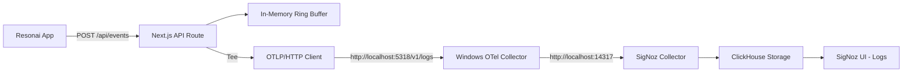

# Resonai ↔ OTel Wiring Guide

This guide documents the integration between Resonai analytics and the local OpenTelemetry → SigNoz observability stack.

> Cross-project context: see the ECRR Project Report for the overarching Examine/Clean/Report/Role summary — [ECRR_PROJECT_REPORT.md](ECRR_PROJECT_REPORT.md)

## Purpose

The wiring forwards sanitized Resonai analytics events from `/api/events` to SigNoz via OTLP/HTTP, enabling:
- Real-time analytics monitoring in SigNoz
- Error rate tracking and alerting
- Performance metrics (TTV, activation rates)
- Debugging and troubleshooting analytics flows

## Dataflow



## Event → LogRecord Mapping

Each Resonai analytics event is converted to an OTLP LogRecord:

### Input Event Schema
```typescript
interface AnalyticsEvent {
  event: string;           // e.g., "screen_view", "permission_granted"
  session_id?: string;     // Session identifier
  variant?: string;        // A/B test variant
  ttv_ms?: number;         // Time to value (milliseconds)
  ua?: string;            // User agent
  cohort?: string;         // User cohort
  user_id?: string;        // User identifier
  props?: Record<string, any>; // Additional properties
  ts?: number;            // Timestamp
}
```

> **Note**: This schema aligns with the `AnalyticsEvent` interface defined in [Resonai Code Map](RESONAI_CODE_MAP.md#core-contracts).

### OTLP LogRecord Output
```typescript
interface OtlpLogRecord {
  body: { stringValue: string };     // JSON stringified original event
  attributes: [
    { key: "dataset", value: { stringValue: "resonai_analytics" } },
    { key: "event", value: { stringValue: "screen_view" } },
    { key: "session_id", value: { stringValue: "session_123" } },
    { key: "variant", value: { stringValue: "test" } },
    { key: "ttv_ms", value: { intValue: 150 } },
    // ... other attributes
  ];
  severityNumber: 9;      // INFO level
  severityText: "INFO";
  timeUnixNano: string;   // Nanoseconds since epoch
  observedTimeUnixNano: string;
}
```

## OTLP/HTTP Endpoint & Ports

- **Collector Endpoint**: `http://localhost:5318/v1/logs`
- **Protocol**: OTLP/HTTP JSON
- **Content-Type**: `application/json`
- **Batch Size**: ≤50 records per request
- **Retry Policy**: 2 retries with exponential backoff (250ms, 750ms)

### Port Configuration
- **5318**: Windows OTel Collector OTLP/HTTP receiver
- **5317**: Windows OTel Collector OTLP/gRPC receiver (not used for this integration)
- **14317**: SigNoz Collector OTLP/gRPC endpoint (collector export target)
- **14318**: SigNoz Collector OTLP/HTTP endpoint (alternative export target)

## Verification

### Automated Verification Script
```powershell
# Run the wiring verification
pwsh -File scripts/verify-wiring.ps1
```

The script will:
1. Check OTel Collector service status
2. Verify port connectivity (5318, 8080)
3. Send a test analytics event to `/api/events`
4. Query SigNoz for the test event
5. Generate artifacts: `artifacts/wiring-verify.txt` and `artifacts/wiring-api.json`

### Manual Verification Steps

1. **Send test event**:
   ```bash
   curl -X POST http://localhost:3000/api/events \
     -H "Content-Type: application/json" \
     -d '{"event":"test_event","session_id":"test-123","variant":"test"}'
   ```

2. **Check SigNoz UI**:
   - Open http://localhost:8080
   - Navigate to Logs
   - Filter: `attributes.dataset = "resonai_analytics"`
   - Look for recent entries

3. **API verification** (if SIGNOZ_API_TOKEN is set):
   ```bash
   curl -X POST http://localhost:8080/api/v5/query_range \
     -H "Content-Type: application/json" \
     -H "Authorization: Bearer $SIGNOZ_API_TOKEN" \
     -d '{
       "start": 1640995200000,
       "end": 1640995260000,
       "requestType": "raw",
       "compositeQuery": {
         "queries": [{
           "type": "builder_query",
           "spec": {
             "name": "A",
             "signal": "logs",
             "filter": {
               "expression": "attributes.dataset = \"resonai_analytics\""
             },
             "order": [{"key": {"name": "timestamp"}, "direction": "desc"}],
             "limit": 10
           }
         }]
       }
     }'
   ```

## SigNoz Dashboard Seeds

### Key Metrics to Track

1. **Error Rate**: `count(level="ERROR") / count(*) * 100`
2. **Event Volume**: `count by (attributes.event)`
3. **TTV Percentiles**: `quantile(0.5, attributes.ttv_ms)`, `quantile(0.9, attributes.ttv_ms)`
4. **Activation Rate**: `count(attributes.event="activation") / count(attributes.event="screen_view")`

### Sample Dashboard Queries

```sql
-- Error rate over time
rate(count by (level) (level="ERROR")[5m]) / rate(count[5m])

-- Top events by volume
count by (attributes.event) (attributes.dataset="resonai_analytics")

-- TTV distribution
histogram_quantile(0.5, sum(rate(attributes.ttv_ms[5m])) by (le))

-- Session analytics
count by (attributes.session_id, attributes.event) (attributes.dataset="resonai_analytics")
```

## Troubleshooting

### Common Issues

#### 1. Port Conflicts
**Symptom**: Connection refused on port 5318
**Solution**: 
- Check if another service is using port 5318: `netstat -an | findstr 5318`
- Verify OTel Collector config uses correct ports
- Restart otelcol-contrib service: `Restart-Service otelcol-contrib`

#### 2. Missing Receivers in Collector Config
**Symptom**: Events not appearing in SigNoz
**Solution**:
- Verify `config.yaml` has OTLP HTTP receiver on port 5318
- Check logs pipeline includes the OTLP receiver
- Ensure no typos in receiver names

#### 3. CORS Issues
**Symptom**: Browser blocks requests to OTLP endpoint
**Solution**:
- OTLP forwarding happens server-side, not browser-side
- If testing from browser, use `/api/events` endpoint, not direct OTLP

#### 4. Service Down
**Symptom**: Health checks fail
**Solution**:
- Check OTel Collector service: `Get-Service otelcol-contrib`
- Check SigNoz containers: `docker ps | findstr signoz`
- Verify health endpoints:
  - Collector: `curl http://localhost:13134/healthz`
  - SigNoz UI: `curl http://localhost:8080`

#### 5. Authentication Required
**Symptom**: 401 Unauthorized from SigNoz API
**Solution**:
- Set `SIGNOZ_API_TOKEN` environment variable
- Get token from SigNoz UI → Settings → API Keys
- For local development, API may not require auth

### Debug Commands

```powershell
# Check collector service status
Get-Service otelcol-contrib

# Test port connectivity
Test-NetConnection -ComputerName localhost -Port 5318

# Check collector logs
Get-WinEvent -LogName "Application" -Source "otelcol-contrib" -MaxEvents 10

# Verify SigNoz UI
Invoke-WebRequest -Uri "http://localhost:8080" -TimeoutSec 5

# Test analytics API
Invoke-RestMethod -Uri "http://localhost:3000/api/events" -Method POST -Body '{"event":"test"}' -ContentType "application/json"
```

### Log Locations

- **OTel Collector Logs**: Windows Event Log → Application
- **SigNoz Logs**: Docker containers (use `docker logs signoz-otel-collector`)
- **Verification Artifacts**: `artifacts/wiring-verify.txt`, `artifacts/wiring-api.json`

## Security & Privacy

### Data Redaction
The integration automatically redacts sensitive information:
- Bearer tokens: `Bearer ***`
- Passwords: `pwd=***`, `password=***`
- API keys: `api_key=***`
- Auth headers: `auth=***`
- Secrets: `secret=***`

### Local-Only Operation
- No external dependencies
- All communication stays on localhost
- No cloud services required
- Data remains on local SigNoz instance

## Performance Considerations

- **Batch Size**: Maximum 50 records per OTLP request
- **Retry Policy**: 2 retries with exponential backoff
- **Non-blocking**: OTel forwarding failures don't affect API responses
- **Memory Usage**: Ring buffer limited to 1000 events in memory
- **Rate Limiting**: 120 requests per minute per client

## Next Steps

1. **Set up Alerts**: Configure SigNoz alerts for error rate spikes
2. **Create Dashboards**: Build analytics dashboards in SigNoz UI
3. **Monitor Performance**: Track TTV and activation metrics
4. **Scale Testing**: Test under load to verify batch processing
5. **Production Migration**: Replace in-memory buffer with persistent storage

## Related Documentation

- **[Resonai Code Map](RESONAI_CODE_MAP.md)** - Complete frontend architecture, contracts, and implementation guide
- **[Query Recipes](QUERY_RECIPES.md)** - SigNoz queries for analytics insights  
- **[Monitoring Setup Guide](../MONITORING_SETUP_GUIDE.md)** - Complete monitoring and alerting configuration
- **[Agent Roles](roles/)** - Understanding the agent ecosystem that maintains this observability pipeline
- **[ECRR Project Report](ECRR_PROJECT_REPORT.md)** - Cross-project summary of Examine / Clean / Report / Role