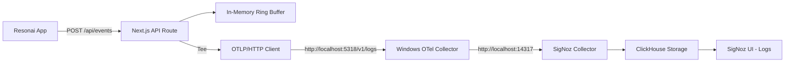

# Resonai ↔ OTel Wiring Guide

This guide documents the integration between Resonai analytics and the local OpenTelemetry → SigNoz observability stack.

> Cross-project context: see the ECRR Project Report for the overarching Examine/Clean/Report/Role summary — [ECRR_PROJECT_REPORT.md](ECRR_PROJECT_REPORT.md)

## Purpose

The wiring forwards sanitized Resonai analytics events from `/api/events` to SigNoz via OTLP/HTTP, enabling:
- Real-time analytics monitoring in SigNoz
- Error rate tracking and alerting
- Performance metrics (TTV, activation rates)
- Debugging and troubleshooting analytics flows

## Dataflow



## Event → LogRecord Mapping

Each Resonai analytics event is converted to an OTLP LogRecord:

### Input Event Schema
```typescript
interface AnalyticsEvent {
  event: string;           // e.g., "screen_view", "permission_granted"
  session_id?: string;     // Session identifier
  variant?: string;        // A/B test variant
  ttv_ms?: number;         // Time to value (milliseconds)
  ua?: string;            // User agent
  cohort?: string;         // User cohort
  user_id?: string;        // User identifier
  props?: Record<string, any>; // Additional properties
  ts?: number;            // Timestamp
}
```

> **Note**: This schema aligns with the `AnalyticsEvent` interface defined in [Resonai Code Map](RESONAI_CODE_MAP.md#core-contracts).

### OTLP LogRecord Output
```typescript
interface OtlpLogRecord {
  body: { stringValue: string };     // JSON stringified original event
  attributes: [
    { key: "dataset", value: { stringValue: "resonai_analytics" } },
    { key: "event", value: { stringValue: "screen_view" } },
    { key: "session_id", value: { stringValue: "session_123" } },
    { key: "variant", value: { stringValue: "test" } },
    { key: "ttv_ms", value: { intValue: 150 } },
    // ... other attributes
  ];
  severityNumber: 9;      // INFO level
  severityText: "INFO";
  timeUnixNano: string;   // Nanoseconds since epoch
  observedTimeUnixNano: string;
}
```

## OTLP/HTTP Endpoint & Ports

- **Collector Endpoint**: `http://localhost:5318/v1/logs`
- **Protocol**: OTLP/HTTP JSON
- **Content-Type**: `application/json`
- **Batch Size**: ≤50 records per request
- **Retry Policy**: 2 retries with exponential backoff (250ms, 750ms)

### Port Configuration
- **5318**: Windows OTel Collector OTLP/HTTP receiver
- **5317**: Windows OTel Collector OTLP/gRPC receiver (not used for this integration)
- **14317**: SigNoz Collector OTLP/gRPC endpoint (collector export target)
- **14318**: SigNoz Collector OTLP/HTTP endpoint (alternative export target)

## Verification

### Automated Verification Script
```powershell
# Run the wiring verification
pwsh -File scripts/verify-wiring.ps1
```

The script will:
1. Check OTel Collector service status
2. Verify port connectivity (5318, 8080)
3. Send a test analytics event to `/api/events`
4. Query SigNoz for the test event
5. Generate artifacts: `artifacts/wiring-verify.txt` and `artifacts/wiring-api.json`

### Manual Verification Steps

1. **Send test event**:
   ```bash
   curl -X POST http://localhost:3000/api/events \
     -H "Content-Type: application/json" \
     -d '{"event":"test_event","session_id":"test-123","variant":"test"}'
   ```

2. **Check SigNoz UI**:
   - Open http://localhost:8080
   - Navigate to Logs
   - Filter: `attributes.dataset = "resonai_analytics"`
   - Look for recent entries
   - Optional: add filter `attributes.log.source = "win-filelog"` to isolate Windows queue logs (upserted by the Windows collector attributes/label_source processor)

3. **API verification** (if SIGNOZ_API_TOKEN is set):
   ```bash
   curl -X POST http://localhost:8080/api/v5/query_range \
     -H "Content-Type: application/json" \
     -H "Authorization: Bearer $SIGNOZ_API_TOKEN" \
     -d '{
       "start": 1640995200000,
       "end": 1640995260000,
       "requestType": "raw",
       "compositeQuery": {
         "queries": [{
           "type": "builder_query",
           "spec": {
             "name": "A",
             "signal": "logs",
             "filter": {
               "expression": "attributes.dataset = \"resonai_analytics\""
             },
             "order": [{"key": {"name": "timestamp"}, "direction": "desc"}],
             "limit": 10
           }
         }]
       }
     }'
   ```

## SigNoz Dashboard Seeds

### Key Metrics to Track

1. **Error Rate**: `count(level="ERROR") / count(*) * 100`
2. **Event Volume**: `count by (attributes.event)`
3. **TTV Percentiles**: `quantile(0.5, attributes.ttv_ms)`, `quantile(0.9, attributes.ttv_ms)`
4. **Activation Rate**: `count(attributes.event="activation") / count(attributes.event="screen_view")`

### Sample Dashboard Queries

```sql
-- Error rate over time
rate(count by (level) (level="ERROR")[5m]) / rate(count[5m])

-- Top events by volume
count by (attributes.event) (attributes.dataset="resonai_analytics")

-- TTV distribution
histogram_quantile(0.5, sum(rate(attributes.ttv_ms[5m])) by (le))

-- Session analytics
count by (attributes.session_id, attributes.event) (attributes.dataset="resonai_analytics")
   ```

### Legacy schema (logs_v2) — sanity checks

Use these ClickHouse queries to verify recent ingestion under the legacy schema. Run from the host via Docker exec or a ClickHouse client.

```bash
docker exec signoz-clickhouse clickhouse-client --query "
  SELECT count() FROM signoz_logs.logs_v2
  WHERE position(body,'agent_queue')>0
    AND fromUnixTimestamp64Nano(timestamp) >= now() - INTERVAL 60 MINUTE;"
```

```bash
docker exec signoz-clickhouse clickhouse-client --query "
  SELECT * FROM signoz_logs.logs_v2
  WHERE position(body,'agent_queue')>0
    AND fromUnixTimestamp64Nano(timestamp) >= now() - INTERVAL 60 MINUTE
  ORDER BY timestamp DESC
  LIMIT 1;"
```

Filter equivalent in SigNoz UI → Logs (Last 1 hour):

- message contains `agent_queue`
- or attributes: `service.name = queue-steward` (after adding filelog attributes)

### Current storage toggle state

- `clickhouselogsexporter.use_new_schema: false` (legacy schema active)
- Do not flip to new schema until the migrator has been run successfully and new tables show fresh rows.

### Safe migration path to new schema

1. Sync schemas:

```bash
docker compose -f docker-compose-signoz.yml run --rm signoz-schema-migrator-sync
```

2. Dual-check for last 10 minutes:

```bash
# Legacy
docker exec signoz-clickhouse clickhouse-client --query "
  SELECT count() FROM signoz_logs.logs_v2
  WHERE position(body,'agent_queue')>0
    AND fromUnixTimestamp64Nano(timestamp) >= now() - INTERVAL 10 MINUTE;"

# New
docker exec signoz-clickhouse clickhouse-client --query "
  SELECT count() FROM signoz_logs.distributed_logs_v2
  WHERE position(body,'agent_queue')>0
    AND fromUnixTimestamp64Nano(timestamp) >= now() - INTERVAL 10 MINUTE;"
```

3. Flip and restart SigNoz collector:

- Edit `signoz-collector-config.yaml`: set `use_new_schema: true`
- Restart: `docker compose -f docker-compose-signoz.yml restart signoz-otel-collector`

4. Re-emit canary and re-validate against `signoz_logs.distributed_logs_v2` (Last 30 minutes).

## Troubleshooting

### Common Issues

#### 1. Port Conflicts & Mismatches
**Symptom**: Connection refused on port 5318 or logs not appearing in SigNoz
**Solution**: 
- Check if another service is using port 5318: `netstat -an | findstr 5318`
- Verify OTel Collector config uses correct ports
- **CRITICAL**: Ensure application instrumentation uses remapped ports (14317/14318) not default ports (4317/4318)
- Restart otelcol-contrib service: `Restart-Service otelcol-contrib`

#### 1.1 Port Mapping Issue (FIXED 2025-09-28)
**Symptom**: "No logs yet" in SigNoz UI despite collector running
**Root Cause**: Applications configured for default ports (4317/4318) but SigNoz running on remapped ports (14317/14318)
**Solution**: Updated all instrumentation to use remapped ports:
- `http://localhost:4317` → `http://localhost:14317`
- `http://localhost:4318` → `http://localhost:14318`

#### 2. OTLP Endpoint Double-Path Error (FIXED 2025-09-28)
**Symptom**: HTTP Status Code 404, "request to http://localhost:14318/v1/logs/v1/logs"
**Root Cause**: Windows collector config had `/v1/logs` appended to endpoint, causing double path
**Solution**: Fixed `config.yaml` OTLP exporter endpoint:
```yaml
# Before (causing double path)
otlphttp:
  endpoint: http://localhost:14318/v1/logs

# After (correct)
otlphttp:
  endpoint: http://localhost:14318
```

#### 3. Missing Receivers in Collector Config
**Symptom**: Events not appearing in SigNoz
**Solution**:
- Verify `config.yaml` has OTLP HTTP receiver on port 5318
- Check logs pipeline includes the OTLP receiver
- Ensure no typos in receiver names

#### 4. CORS Issues
**Symptom**: Browser blocks requests to OTLP endpoint
**Solution**:
- OTLP forwarding happens server-side, not browser-side
- If testing from browser, use `/api/events` endpoint, not direct OTLP

#### 5. Service Down
**Symptom**: Health checks fail
**Solution**:
- Check OTel Collector service: `Get-Service otelcol-contrib`
- Check SigNoz containers: `docker ps | findstr signoz`
- Verify health endpoints:
  - Collector: `curl http://localhost:13134/healthz`
  - SigNoz UI: `curl http://localhost:8080`

#### 6. Authentication Required
**Symptom**: 401 Unauthorized from SigNoz API
**Solution**:
- Set `SIGNOZ_API_TOKEN` environment variable
- Get token from SigNoz UI → Settings → API Keys
- For local development, API may not require auth

### Debug Commands

#### Standard Debugging
```powershell
# Check collector service status
Get-Service otelcol-contrib

# Test port connectivity
Test-NetConnection -ComputerName localhost -Port 5318

# Check collector logs
Get-WinEvent -LogName "Application" -Source "otelcol-contrib" -MaxEvents 10

# Verify SigNoz UI
Invoke-WebRequest -Uri "http://localhost:8080" -TimeoutSec 5

# Test analytics API
Invoke-RestMethod -Uri "http://localhost:3000/api/events" -Method POST -Body '{"event":"test"}' -ContentType "application/json"
```

#### Docker Debug (Pro Subscription Required)
**NEW**: Docker Pro subscription enables advanced container debugging capabilities:

```powershell
# Interactive debugging session
docker debug signoz-otel-collector

# Install debugging tools on-demand
docker debug --command "install prometheus && prometheus --version" signoz-otel-collector

# Check network ports from inside container
docker debug --command "install net-tools && netstat -tlnp | grep 431" signoz-otel-collector

# Verify collector health
docker debug --command "curl -s http://localhost:13133/health" signoz-otel-collector

# Inspect configuration files
docker debug --command "cat /etc/otel-collector-config.yaml | head -20" signoz-otel-collector

# Analyze container startup behavior
docker debug --command "entrypoint --print" signoz-otel-collector

# Install monitoring tools
docker debug --command "install htop && htop --version" signoz-otel-collector
```

**Docker Debug Features**:
- **Slim Container Debugging**: Works on containers without shells
- **Custom Toolbox**: Install any Nix package on-demand
- **Entrypoint Analysis**: Understand container startup behavior
- **Non-destructive**: Changes don't persist to actual containers
- **Interactive Shell**: Full debugging environment

**Prerequisites**: Docker Desktop Pro/Team/Business subscription + sign-in

### Helper Scripts

The following helper scripts are available for quick verification and maintenance:

#### `scripts/sz-health.ps1`
Quick health check for SigNoz containers and Windows Collector:
```powershell
pwsh -File scripts\sz-health.ps1
```
- Checks SigNoz container status
- Verifies Windows Collector service state
- Tests SigNoz UI health endpoint
- Shows collector configuration preview

#### `scripts/sz-restart.ps1`
Quick restart of Windows Collector service:
```powershell
pwsh -File scripts\sz-restart.ps1
```
- Stops and starts otelcol-contrib service
- Verifies service state after restart
- Useful after configuration changes

#### `scripts/e2e-pr.ps1`
Run E2E tests for PR validation:
```powershell
pwsh -File scripts\e2e-pr.ps1
```
- Runs stable E2E tests (excludes @flaky)
- Different behavior for CI vs local environments
- Ensures PR lane stays green

### Log Locations

- **OTel Collector Logs**: Windows Event Log → Application
- **SigNoz Logs**: Docker containers (use `docker logs signoz-otel-collector`)
- **Verification Artifacts**: `artifacts/wiring-verify.txt`, `artifacts/wiring-api.json`

## Verification & Health Checks

### Quick Health Check
```powershell
# Run comprehensive health check
pwsh -File scripts\sz-health.ps1

# Expected output:
# - SigNoz containers running (signoz-otel-collector, signoz, signoz-clickhouse)
# - Windows Collector service: RUNNING
# - SigNoz UI: Healthy
```

### Canary Test Verification
```powershell
# Run canary test to verify end-to-end pipeline
pwsh -File .\canary-test.ps1

# Expected output:
# [OK] Wrote canary log entry to C:\logs\canary-test.log
# [OK] Created Windows Event Log entry
# [OK] Sent OTLP trace (http://localhost:5318/v1/traces)
# [OK] Sent OTLP log (http://localhost:5318/v1/logs)
```

### SigNoz UI Verification

#### Logs Verification
1. Open SigNoz UI: http://localhost:8080/logs
2. Add filter: `message contains "canary test"`
3. Verify recent entries appear with:
   - `service.name = "canary-test"`
   - `canary = "true"`
   - `test.type = "pipeline-verification"`

#### Traces Verification
1. Open SigNoz UI: http://localhost:8080/traces
2. Filter by: `service.name = "windows-collector"`
3. Verify canary traces appear with:
   - `canary = "true"`
   - `test.type = "pipeline-verification"`
   - Proper span timing and attributes

### Configuration Verification
```powershell
# Verify traces pipeline is configured
Get-Content -Path 'C:\otel\config.yaml' | Select-String -Pattern "traces|service.name|windows-collector" -Context 2

# Expected output:
# - traces pipeline with OTLP receiver
# - service.name = windows-collector in resource defaults
# - batch/traces processor configured
```

### Windows Event Log Verification
```powershell
# Check for canary events
Get-EventLog -LogName Application -Source "SigNoz-Canary" -Newest 5

# Verify canary log file
Get-Content "C:\logs\canary-test.log" | Select-Object -Last 1
```

### Complete Wiring Test (Optional)
```powershell
# For full analytics API testing (requires Resonai dev server on port 3003)
pwsh -File scripts\verify-wiring.ps1

# Note: This requires the Resonai dev server to be running with /api/events endpoint
# For basic verification, use the canary test instead
```

## Security & Privacy

### Data Redaction
The integration automatically redacts sensitive information:
- Bearer tokens: `Bearer ***`
- Passwords: `pwd=***`, `password=***`
- API keys: `api_key=***`
- Auth headers: `auth=***`
- Secrets: `secret=***`

### Local-Only Operation
- No external dependencies
- All communication stays on localhost
- No cloud services required
- Data remains on local SigNoz instance

## Performance Considerations

- **Batch Size**: Maximum 50 records per OTLP request
- **Retry Policy**: 2 retries with exponential backoff
- **Non-blocking**: OTel forwarding failures don't affect API responses
- **Memory Usage**: Ring buffer limited to 1000 events in memory
- **Rate Limiting**: 120 requests per minute per client

## Next Steps

1. **Set up Alerts**: Configure SigNoz alerts for error rate spikes
2. **Create Dashboards**: Build analytics dashboards in SigNoz UI
3. **Monitor Performance**: Track TTV and activation metrics
4. **Scale Testing**: Test under load to verify batch processing
5. **Production Migration**: Replace in-memory buffer with persistent storage

## Related Documentation

- **[Resonai Code Map](RESONAI_CODE_MAP.md)** - Complete frontend architecture, contracts, and implementation guide
- **[Query Recipes](QUERY_RECIPES.md)** - SigNoz queries for analytics insights  
- **[Monitoring Setup Guide](../MONITORING_SETUP_GUIDE.md)** - Complete monitoring and alerting configuration
- **[Agent Roles](roles/)** - Understanding the agent ecosystem that maintains this observability pipeline
- **[ECRR Project Report](ECRR_PROJECT_REPORT.md)** - Cross-project summary of Examine / Clean / Report / Role
